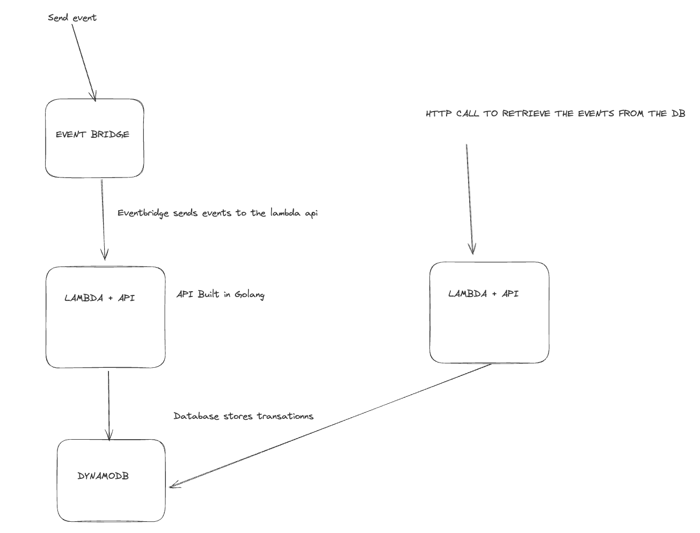

# A simple example of event driven application using Go, AWS Go CDK, and AWS services

# Useful commands:

- make deploy: to build the lambda and deploy the cdk stack

- cdk bootstrap: create s3 bucket to store the cloudformation template inside your account

- cdk synth: to verify that the stack compilers properly. when doing a cdk synth delete your cdk.out folder.

- cdk deploy: to deploy the stack

- cdl destroy: delete all your stack on aws env

Diagram:

